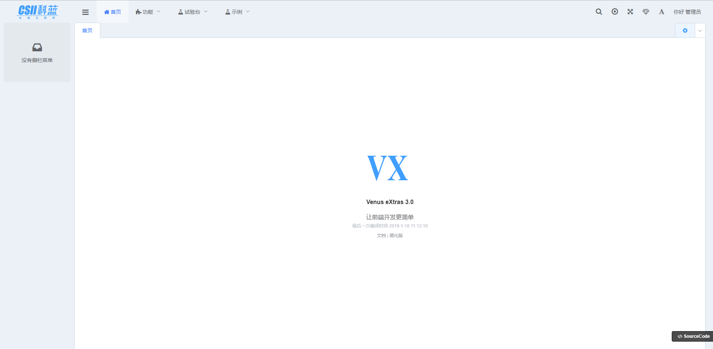

# 迎接VX3.0

适配VX-Gate的脚手架，轻松构建管理项目，丰富模板一键创建，提供多种垂直领域模板，快速创建项目，支持风格切换，满足个性化需求；轻松操作页面管理，海量模块自由搭配，页面组合可视化操作更得心应手；开发调试一体化，集成运行环境零配置运行，开箱即用。

## 开发环境的统一-编辑器

编辑器推荐使用[Visual Studio Code](https://code.visualstudio.com/)。vscode通过插件可以支持[ESLint](https://cn.eslint.org/)和[editorconfig for VS Code](https://editorconfig.org/)

其他推荐安装插件：

[Vetur]  Vue语法高亮，错误检查，格式化，自动提示等,注意：要禁用【Beautify】插件

在VS code 的配置文件settings.json中添加以下配置

```json
// 保存时格式化
  "editor.formatOnSave": true,
  "vetur.format.defaultFormatter.html": "prettyhtml",
  // vetur 的自定义设置
  "vetur.format.defaultFormatterOptions": {
    "prettier": {
      // prettier 设置强制单引号
      "singleQuote": true,
      // prettier 设置语句末尾不加分号
      "semi": false
    }
  }
```

[Auto Close Tag] 自动闭合HTML/XML标签

[Auto Rename Tag] 自动完成另一侧标签的同步修改

[HTML CSS Support] 让 html 标签上写class 智能提示当前项目所支持的样式

编写代码时，须按eslint规范，进行格式化。
（原型自带的eslint语法检测及修复工具 npm run lint）

## 项目地址

[csii.vx3.web](http://118.144.87.37:12380/vx-git/vx-prototype3/csii.vx3.web.git)

## 本原型工程需要vue cli 3.3+

```js
npm install -g @vue/cli
```

## 项目启动

### 安装依赖

```sh
npm install
```

### 开发模式下编译并热更新

```sh
npm start
```

or

```sh
npm run serve
```

### 生产模式下编译并压缩

```sh
npm run build
```

### 执行ESLint检查，并修复

```sh
npm run lint
```

## 目录结构

dist// 此目录中的文件用于打包构建项目
node_modules // 开发环境所依赖的node包
public// 静态资源，区别于 assets ，public不参与webpack的打包，只拷贝
  |index.html // 模板文件
src // 开发所用的主要文件夹
  | api 接口api
  | assets // 静态资源
  | components // 全局组件
  | i18n 国际化
  | layout 布局组件
  | libs// 全局混入的 方法、过滤器、工具方法等
  | mock// 模拟数据
  | pages // vue页面
  | plugin // 全局插件
  | router // 路由配置文件
  | store // vuex 全局状态管理
  main.js // 入口文件
  setting.js // 项目的配置文件
.browserslistrc // 配置支持的浏览器列表
.editorconfig // 编辑器风格文件
.env //在所有的环境中被载入
.env.development  // 只在development模式中被载入
.env.nomock // 只在nomock模式中被载入
.eslintignore // 配置eslint忽略校验的文件及文件夹
.eslintrc.js // eslint配置文件，配置eslint规则等
.gitignore // 配置git提交时忽略的文件
.postcssrc.js // postcss配置文件
.babel.config.js // babel 配置文件
package.json // 工程描述文件
routegen.js // 自动生成对应的路由及页面模板
vue.config.js // vue cli 配置文件

## 本原型工程使用mock功能

注意：使用时可参考src/mock中的例子。

### 1、直接在data下面添加接口对应的json文件

>例如InnerPre.json，请求时InnerPre.do，名称一一对应

### 2、配置mock数据，注释该选项即可,项目中默认注释即使用模拟数据（Demo中需要mock）

>注意：若要转发到后台，在env.development文件中请放开此处

```js
# 标记当前是 No Mock 构建
# VUE_APP_BUILD_MODE=nomock
```

## 本原型工程保存后台返回数据

### 1、在env文件夹中配置转发的前缀

```js
# 网络请求公用地址
VUE_APP_API=/api/
```

### 2、在vue.config.js文件中配置转发的后端地址target的值

默认:转发前缀为env文件中配置VUE_APP_API的值
target为'http://localhost:9001'

```js
......
proxy: {
  [context]: {
    target: 'http://localhost:9001',
    changeOrigin: true,
    onProxyRes: saveJSON ? recordProxyJson : null
  }
}
......
```

### 3、 env.development文件中配置是否保存模拟数据，默认false

```js
# 是否启用 记录 JSON 功能
APP_SAVE_JSON = true
```

### 4、 配置不使用Mock

若要转发到后台，env.development文件中请放开此处

```js
# 标记当前是 No Mock 构建
VUE_APP_BUILD_MODE=nomock
```

### 5、其他Vue工程 mock功能迁移

请按照管理端修改本地项目，步骤如下：

1. 本地代码先提交git或svn

2. 使用管理端中mock文件夹全部覆盖本地项目对应文件夹

3. 使用管理端中vue.config.js覆盖本地项目对应文件

4. 使用管理端中.env,.env.development覆盖本地项目对应文件

5. 使用管理端中package.json覆盖本地项目对应文件，并重新安装

6. 与git或svn对比，还原被覆盖的自定义改动

7. 进行测试，测试没有提交代码

## 菜单与路由

提供了`routegen.js`简化路由配置，帮助做一些初始化工作。当然，你也可以自己手动注册一个个路由，新建对应页面，如果你这么做的话，可以跳过下边关于初始化的内容。

### 路由初始化

工程的菜单和路由逻辑由菜单开始，需要先有一份全量菜单数据，如`/src/mock/menu.json`中的结构。

这个`json`文件中的内容可以从服务端获取全量菜单组装，也可以自己根据业务要求组装。

此时，前端工程并未启动。我们的目的是在`node`环境下，做一些初始化工作。

用`node` 命令执行 根目录下的`routegen.js` 文件，生成前端路由配置文件。如果加上`--page`参数，则会在生成路由配置文件
的同时，生成对应目录下的.vue页面

```bash
node routegen.js
# 生成路由的同时产生页面
node routegen.js --page
```

每个一级菜单会产生一个一个js文件，一级菜单的`path`对应一级路由的`path`，该一级菜单下其他菜单统一作为二级路由

注意：

1. 使用时你可能需要修改`routegen.js`中对应的`menuData`
2. 如果准备的菜单数据与`/src/mock/menu.json`结构不一致，你需要自己作相应的修改

### 菜单json文件

```json
{
  "path": "/demo/clayjs", // 一级菜单路由路径
  "value": "demo-clayjs", // 创建的路由文件的名称、一级路由的name
  "title": "clayjs图表", // 元信息title
  "iconSvg": "flask", // svg图标
  "children": [
    {
      "path": "/demo/clayjs/list/line", // 子菜单路由，若子菜单的value值没有提供则转换为路由name
      "value": "demo-clayjs-list-line", // 子菜单路由name
      "title": "折线图", // 元信息title
      "icon": "home" // font-awesome 图标名称
    }
  ]
}
```

### 持久化菜单数据

路由初始化完成后，我们一般需要从*登录*交易中获取特定用户对应的*菜单*。获取之后把菜单存入了`localStorage`，当用户刷新页面后重新初始化菜单。

```js
// 持久化菜单数据 /src/store/modules/vxadmin/modules/account.js
dispatch('vxadmin/menu/initMenu', menuHeader, { root: true })

// 刷新页面后，从localStorage中获取菜单，如果有，则重新设置菜单
this.$store.dispatch('vxadmin/menu/loadMenu').then(menu => {
  if (menu) {
    this.$store.commit('vxadmin/menu/headerSet', menu)
  }
})
```

### 顶部菜单Header与左侧菜单Aside的联动

这个功能的实现依赖于第一步*初始化*的路由配置
> 所有 *一级路由* 的`path`与 *一级菜单* 的 `path`对应，该 *一级菜单* 下的其他菜单作为对应 *一级路由* 的子路由

在此基础上，当路由跳转时，获取一级路由的`path`，根据`path`从菜单数据中拿到对应菜单的`children`，将其作为侧边菜单。

```js
// main.js中设置左侧菜单
watch: {
  // 检测路由变化切换侧边栏内容
  '$route.matched': {
    handler(matched) {
      if (matched.length > 0) {
        // change by lss
        const menuAside = this.$store.state.vxadmin.menu.header

        const _side = menuAside.filter(menu => menu.path === matched[0].path)
        this.$store.commit('vxadmin/menu/asideSet', _side.length > 0 ? _side[0].children : [])
      }
    },
    immediate: true
  }
}

```

### 菜单与路由权限

权限的控制在`vue-router`的导航守卫`beforeEach`中实现。

当路由跳转时，遍历该路由的`path`是否在 *登录时获取的* 菜单中存在，存在则跳转，否则不允许跳转。

## 构建生产版本

### 若node出现内存溢出

1、判断是否安装相关依赖包（cross-env、increase-memory-limit），若没有请执行，
若已经安装请跳过

1)、配置package.json

```js
 "scripts": {
   ...
    "fix-memory-limit": "cross-env LIMIT=4096 increase-memory-limit"
 }  
```

2）、安装依赖

```js
npm install cross-env increase-memory-limit -D
```

or 重新安装所有依赖

```js
npm install
```

2、安装完依赖后，请执行

```js
npm run fix-memory-limit
```

3、若是mac电脑，安装完后，运行npm run build可能会报错，请按照提醒进行修改

例如：node_modules/.bin/vue-cli-service文件中有错误

```js
const requiredVersion = require('../package.json').engines.node --max-old-space-size=4096
```

改为

```js
const requiredVersion = require('../package.json').engines.node
```

## 性能优化

### 配置gzip

可在html、css、js文件大小大于10kb(服务端配置)时进行文件gzip,减少传输的时间,需要web服务器支持gzip，进行相应的配置

* 若需要使用请参考该链接进行服务器配置[前端性能优化之gzip](https://segmentfault.com/a/1190000012571492?utm_source=tag-newest)

#### 1、tomcat

tomcat的配置如下：

找到tomcat的server.xml文件，找到其中Connector节点然后进行配置修改，具体配置如下

```xml
<Connectorport="80"protocol="HTTP/1.1" connectionTimeout="20000" redirectPort="8443" URIEncoding="UTF-8" maxPostSize="0" useBodyEncodingForURI="true"compression="on" compressionMinSize="2048" noCompressionUserAgents="gozilla, traviata" compressableMimeType="text/html,text/xml,application/javascript,text/css,text/plain,image/jpeg,application/json"/>
```

参数说明：

* compression="on" 打开压缩功能
* compressionMinSize="2048" 启用压缩的输出内容大小，当被压缩对象的大小>=该值时才会被压缩，这里面默认为2KB
* noCompressionUserAgents="gozilla, traviata" 对于以下的浏览器，不启用压缩
* compressableMimeType="text/html,text/xml,text/javascript,text/css,text/plain" 压缩类型

***注意***：tomcat7以后，js文件的mimetype类型变为了application/javascript，而在tomcat7以下则为text/javascript;具体的tomcat7定义的类型可以在：conf/web.xml文件中找到

可以在web.xml下搜索，如我搜索javascript会找到如下代码

```xml
<mime-mapping>
    <extension>js</extension>
    <mime-type>application/javascript</mime-type>
</mime-mapping>
```

***切记上面的类型不能配置错了，如果配置错了压缩是不会起作用的***

#### 2、nginx

gzip使用环境:http,server,location,if(x),一般把它定义在nginx.conf的http{…..}之间

* __gzip on__

  on为启用，off为关闭

* __gzip_min_length 1k__

  设置允许压缩的页面最小字节数，页面字节数从header头中的Content-Length中进行获取。默认值是0，不管页面多大都压缩。建议设置成大于1k的字节数，小于1k可能会越压越大。

* __gzip_buffers 4 16k__

  获取多少内存用于缓存压缩结果，‘4 16k’表示以16k*4为单位获得

* __gzip_comp_level 5__

  gzip压缩比（1~9），越小压缩效果越差，但是越大处理越慢，所以一般取中间值;

* __gzip_types text/plain application/x-javascript text/css application/xml text/javascript application/x-httpd-php__

  对特定的MIME类型生效,其中'text/html’被系统强制启用

* __gzip_http_version 1.1__

  识别http协议的版本,早起浏览器可能不支持gzip自解压,用户会看到乱码
* __gzip_vary on__

  启用应答头"Vary: Accept-Encoding"

* __gzip_proxied off__

  nginx做为反向代理时启用,off(关闭所有代理结果的数据的压缩),expired(启用压缩,如果header头中包括"Expires"头信息),no-cache(启用压缩,header头中包含"Cache-Control:no-cache"),no-store(启用压缩,header头中包含"Cache-Control:no-store"),private(启用压缩,header头中包含"Cache-Control:private"),no_last_modefied(启用压缩,header头中不包含"Last-Modified"),no_etag(启用压缩,如果header头中不包含"Etag"头信息),auth(启用压缩,如果header头中包含"Authorization"头信息)

* __gzip_disable msie6__

  (IE5.5和IE6 SP1使用msie6参数来禁止gzip压缩 )指定哪些不需要gzip压缩的浏览器(将和User-Agents进行匹配),依赖于PCRE库

以上代码可以插入到 http {...}整个服务器的配置里，也可以插入到虚拟主机的 server {...}或者下面的location模块内

## admin

### 功能

* 使用 vue-cli3 构建
* 首屏加载等待动画
* 五款主题
* 内置 UEditor 富文本编辑器
* 详细的文档
* 登录和注销
* 分离的路由和菜单设置
* 可折叠侧边栏
* 多国语
* 富文本编辑器
* Markdown 编辑器
* 全屏
* Fontawesome 图标库
* 图标选择器
* 自动注册 SVG 图标
* 模拟数据
* 剪贴板封装
* 图表库
* 时间日期计算工具
* 导入 Excel （ xlsx + csv ）
* 数据导出 Excel （ xlsx + csv ）
* 数据导出文本
* 数字动画
* 可拖拽调整大小的区块布局
* 可拖拽调整大小和位置的网格布局
* 开箱即用的页面布局组件
* 加载并解析 markdown 文件
* GitHub 样式的 markdown 显示组件
* markdown 内代码高亮
* 为 markdown 扩展了百度云链接解析和优化显示
* 右键菜单组件
* 自定义滚动条和滚动控制
* 公用样式抽离，方便的主题定制
* 支持临时菜单配置
* 系统功能展示模块 `1.1.4 +`
* 多标签页模式 `1.1.4 +`
* 美化滚动条 `1.1.4 +`
* json view `1.1.4 +`
* cookie 封装 `1.1.5 +`
* 多标签页全局控制 API `1.1.5 +`
* 菜单全局控制 API `1.1.5 +`
* 多标签页关闭控制支持右键菜单 `1.1.10 +`
* 模块化全局状态管理 `1.2.0 +`
* 多种数据持久化方式：区分用户，区分路由，页面数据快照功能 `1.2.0 +`
* 支持跳出外部链接的菜单系统 `1.2.0 +`
* 支持菜单 svg 图标 `1.3.0 +`
* 日志记录和错误捕捉 `1.3.0 +`
* 全局菜单搜索 `1.3.0 +`
* 自定义登录重定向 `1.3.0 +`
* 切换全局基础组件尺寸 `1.4.0 +`
* 页面载入进度条 `1.4.1 +`
* 自适应的顶部菜单栏 `1.4.7 +`
* 数据导出 xslx 时支持合并单元格 `1.5.4 +`

### 新增

`.env.development`文件中的`APP_SAVE_JSON`设置成`true`，即可开启*根据返回数据生成JSON文件功能*

### 版本

| 名称 | GitLab  | 描述 |
| --- | --- | --- |
| 完整版 | [GitLab](http://git.csii.com.cn/vxu/trunk/vx-prototype3/csii.vx3.admin) | 完整版VX3.0 |
| 简化版 | [GitLab](http://git.csii.com.cn/vxu/trunk/vx-prototype3/csii.vx3.admin.cli) |VX-Gate脚手架 |

@ csii vx
